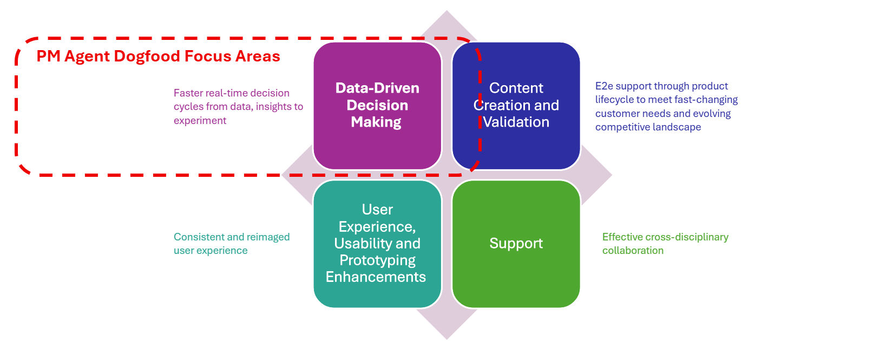

# Welcome to Onboard Product Management (PM) Agent

## What's PM Agent? 

The Product Management (PM) Agent is an AI-powered assistant that streamlines routine tasks and helps anyone involved in product management (e.g., product managers, engineers, analysts, and program manager) overcome challenges across the entire product lifecycle.​

- **Data driven decision making**: The PM Agent accelerates real-time decision-making by transforming structured and semi-structured data into actionable insights through statistical and semantic analysis. It supports both product business insights—such as identifying patterns, behaviors, and segment comparisons—and customer research insights, including recurring themes, correlations with telemetry, and user journey mapping. This enables faster, more informed experimentation across the product lifecycle.
    - Product Business Insights: Identify patterns from time-series data, behaviors from cohort analysis, and comparisons via segmentation analysis.​
    - Customer Research/Feedback Insights: Detect recurring themes from thematic analysis, discover correlations linking product telemetry with feedback, and map user workflows and emotional insights.
- **Content Creation and Validation**: The PM Agent provides end-to-end support across the product lifecycle, helping teams respond to fast-changing customer needs and an evolving competitive landscape. It transforms unstructured information—such as text, transcripts, documents, emails, and annotated images from sources like SharePoint or the web—into actionable reports through intelligent information analysis. Its capabilities span Product Content (requirement definition, demo validation, release notes, revision history), Product Management (planning and alignment), and Product Analysis (competitive analysis, market research).
- **User Experience, Usability and Prototyping Enhancements**: The PM Agent enhances user experience, usability, and prototyping by delivering a consistent and reimagined user experience powered by organizational and domain guidance or best practice. ​
    - Usability: Task-driven usability insights and A/B usability comparisons​
    - UX: Design validation against organizational or domain design language​
    - Prototyping: Rapid demo generation from scripts
- **Support**: The PM Agent strengthens cross-disciplinary collaboration by leveraging organizational, product, and personal knowledge to connect the right insights to the right people.​
    - External Support: Accelerated customer support and faster internal issue resolution​
    - Ramp-Up Enablement: Q&A and guidance for new employees or product onboarding​
    - Knowledge Integration: Seamless access to org, product, and personal expertise for more effective teamwork​

PM Agent Dogfood mainly focus on data-driven decision-making scenario and part of content creation scenario. ​

## How to Onboard PM Agent Dogfood? 

> [!IMPORTANT]
> Create a [GitHub issue with onboarding checklist](https://github.com/Azure/PMAgent-onboarding/issues/new?template=pm-agent-onboarding-checklist-template.md) to onboard your product to PM agent. 